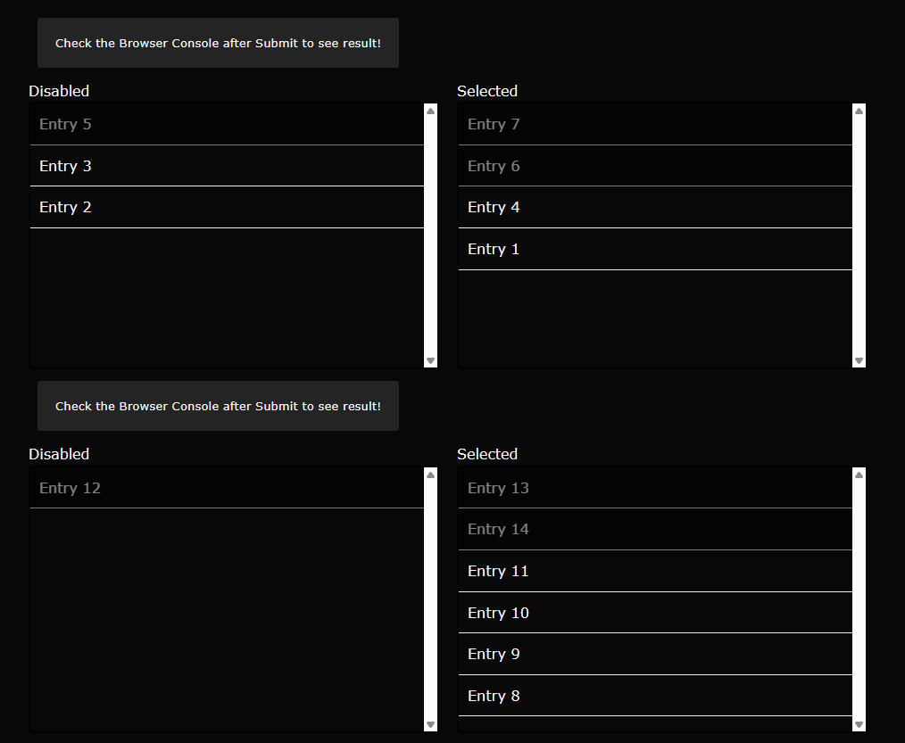

# Bugfish Sortselect (jquery selectbox plugin)

## 🔍 Overview

The "multiselect-sortable" jQuery plugin enhances the functionality of multiple select elements by allowing you to easily sort and manage selected options in a dual list box. This revised version of the plugin now includes a "rid" (Resource Identifier) parameter, which helps in distinguishing between different instances of the script when used on the same webpage. Failure to provide a unique "rid" value for each instance can result in errors or unexpected behavior.

> [!NOTE]
> No new features are planned for this project at this time.

> [!TIP]
> This project is actively maintained, with regular updates and prompt fixes for reported issues.

### Screenshot

### How to use

Load the necessary jQuery libraries:

	
	

Load the multiselect-sortable plugin's JavaScript and CSS files:

	
	<link rel="stylesheet" href="assets/css/jquery.multiselect.sortable.js.css" />

Add the "multiselectsortable" class to your multiple select element and define pre-selected options using the "selected" attribute. Ensure you provide a unique "rid" value for each instance:
	
	<select name="multiselectsortable" class="multiselectsortable demo multiselectsortable-1" multiple data-rid="instance-1">
	</select>
	 
	<select name="multiselectsortable" class="multiselectsortable demo multiselectsortable-2" multiple data-rid="instance-2">
	</select>

	<select name="multiselectsortable" class="multiselectsortable demo multiselectsortable-3" multiple data-rid="instance-3">
	</select>

Call the function on the select element to activate the plugin, ensuring you pass the "rid" parameter for each instance:

	 jQuery(function($){
	   // Example 1
	   $('.multiselectsortable-1').bugfish_sortselect({
	    rid: 'instance-1'
	   });
	 });
	
	
	 jQuery(function($){
	   // Example 2
	   $('.multiselectsortable-2').bugfish_sortselect({
	    rid: 'instance-2'
	   });
	 });
	
	
	jQuery(function($){
	  // Example 3
	  $('.multiselectsortable-3').bugfish_sortselect({
	   rid: 'instance-3'
	 });
	});

### jQuery and jQuery-UI Included for Convenience

In this repository, both jQuery and jQuery-UI are included to showcase the functionality of the repository's related jQuery plugin. We have included these libraries to make it easier for developers who use this product to implement it quickly. By providing jQuery and jQuery-UI JavaScript files, we aim to streamline the development process and ensure that developers have the necessary resources readily available to harness the full potential of this repository's features. This convenience is intended to simplify integration and help developers get up and running with the provided plugin more efficiently.

## 📖 Documentation

The following documentation is intended for both end-users and developers.

| **Description**                                                       | **Link**                                                                                         |
|----------------------------------------------------------------------|-------------------------------------------------------------------------------------------------|
| Access the online documentation for this project. | [https://bugfishtm.github.io/bugfish-jquery-sortselect/index.html](https://bugfishtm.github.io/bugfish-jquery-sortselect/index.html)  |
| If you'd prefer to access the documentation locally, you can find it at. | [./docs/index.html](./docs/index.html) |

## ❓ Support Channels

If you encounter any issues or have questions while using this software, feel free to contact us:

- **GitHub Issues** is the main platform for reporting bugs, asking questions, or submitting feature requests: [https://github.com/bugfishtm/bugfish-jquery-sortselect/issues](https://github.com/bugfishtm/bugfish-jquery-sortselect/issues)
- **Discord Community** is available for live discussions, support, and connecting with other users: [Join us on Discord](https://discord.com/invite/xCj7AEMmye)  
- **Email support** is recommended only for urgent security-related issues: [security@bugfish.eu](mailto:security@bugfish.eu)

## 📢 Spread the Word

Help us grow by sharing this project with others! You can:  

* **Tweet about it** – Share your thoughts on [Twitter/X](https://twitter.com) and link us!  
* **Post on LinkedIn** – Let your professional network know about this project on [LinkedIn](https://www.linkedin.com).  
* **Share on Reddit** – Talk about it in relevant subreddits like [r/programming](https://www.reddit.com/r/programming/) or [r/opensource](https://www.reddit.com/r/opensource/).  
* **Tell Your Community** – Spread the word in Discord servers, Slack groups, and forums.  

## 📁 Repository Structure 

This table provides an overview of key files and folders related to the repository. Click on the links to access each file for more detailed information. If certain folders are missing from the repository, they are irrelevant to this project.

|Document Type|Description|
|----|-----|
| .github | Folder with github setup files. |
| [.github/CODE_OF_CONDUCT.md](./.github/CODE_OF_CONDUCT.md) | The community guidelines. |
| _changelogs | Folder for changelogs. |
| _releases | Folder for releases. |
| _screenshots | Folder with project screenshots. |
| _source | Folder with the source code. |
| docs | Folder for the documentation. | 
| .gitattributes | Repository setting file. Only for development purposes. |
| .gitignore | Repository ignore file. Only for development purposes. |
| README.md | Readme of this project. You are currently looking at this file. |
| repository_reset.bat | File to reset this repository. Only for development purposes. |
| repository_update.bat | File to update this repository. Only for development purposes. |
| [CONTRIBUTING.md](CONTRIBUTING.md) | Information for contributors. | 
| [CHANGELOG.md](CHANGELOG.md) | Information about changelogs. | 
| [SECURITY.md](SECURITY.md) | How to handle security issues. |
| [LICENSE.md](LICENSE.md) | License of this project. |

## 📑 Changelog Information

Refer to the `_changelogs` folder for detailed insights into the changes made across different versions. The changelogs are available in **HTML format** within this folder, providing a structured record of updates, modifications, and improvements over time. Additionally, **GitHub Releases** follow the same structure and also include these changelogs for easy reference.

## 🌱 Contributing to the Project

I am excited that you're considering contributing to our project! Here are some guidelines to help you get started.

**How to Contribute**

1. Fork the repository to create your own copy.
2. Create a new branch for your work (e.g., `feature/my-feature`).
3. Make your changes and ensure they work as expected.
4. Run tests to confirm everything is functioning correctly.
5. Commit your changes with a clear, concise message.
6. Push your branch to your forked repository.
7. Submit a pull request with a detailed description of your changes.
8. Reference any related issues or discussions in your pull request.

**Coding Style**

- Keep your code clean and well-organized.
- Add comments to explain complex logic or functions.
- Use meaningful and consistent variable and function names.
- Break down code into smaller, reusable functions and components.
- Follow proper indentation and formatting practices.
- Avoid code duplication by reusing existing functions or modules.
- Ensure your code is easily readable and maintainable by others.

## 🤝 Community Guidelines

We’re on a mission to create groundbreaking solutions, pushing the boundaries of technology. By being here, you’re an integral part of that journey. 

**Positive Guidelines:**
- Be kind, empathetic, and respectful in all interactions.
- Engage thoughtfully, offering constructive, solution-oriented feedback.
- Foster an environment of collaboration, support, and mutual respect.

**Unacceptable Behavior:**
- Harassment, hate speech, or offensive language.
- Personal attacks, discrimination, or any form of bullying.
- Sharing private or sensitive information without explicit consent.

Let’s collaborate, inspire one another, and build something extraordinary together!

## 🛡️ Warranty and Security

I take security seriously and appreciate responsible disclosure. If you discover a vulnerability, please follow these steps:

- **Do not** report it via public GitHub issues or discussions. Instead, please contact the [security@bugfish.eu](mailto:security@bugfish.eu) email address directly.   
- Provide as much detail as possible, including a description of the issue, steps to reproduce it, and its potential impact.  

I aim to acknowledge reports within **2–4 weeks** and will update you on our progress once the issue is verified and addressed.

This software is provided as-is, without any guarantees of security, reliability, or fitness for any particular purpose. We do not take responsibility for any damage, data loss, security breaches, or other issues that may arise from using this software. By using this software, you agree that We are not liable for any direct, indirect, incidental, or consequential damages. Use it at your own risk.

## 📜 License Information

The license for this software can be found in the [LICENSE.md](LICENSE.md) file. Third-party licenses are located in the ./_licenses folder. The software may also include additional licensed software or libraries.

🐟 Bugfish 
